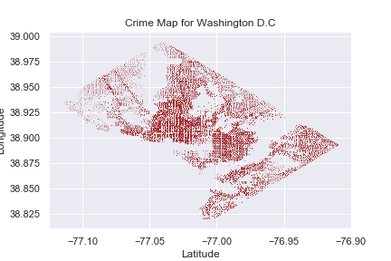
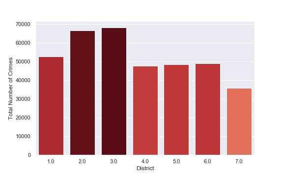
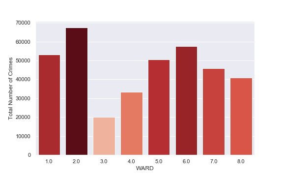
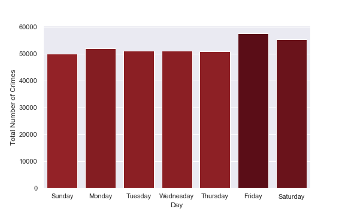
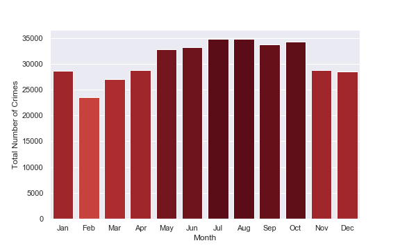
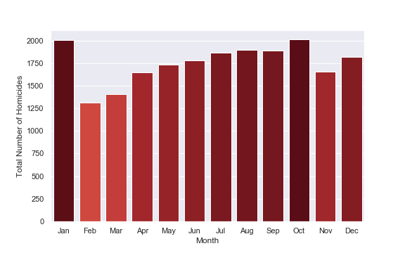

# Analysis of Crime in Washington DC
Repository for analysis on Washington DC crime data analysis.
   
           
### Team Members: 

Irais Garcia, Omar Haddad, Lolita Dias , Nithin Sunil.   

### Understanding the trends and patterns in crime rates and to identify the most dangerous areas of D.C
Finding crime patterns and trends in DC by area to provide better information for law enforcement and civilians

## Questions:
1. Where is crime concentrated in D.C? 
2. When were crimes most likely to occur?
3. What were the most common crimes in D.C? 
4. Which type of crime is prominent in each area? 

## Datasets Used: 
 1. https://opendata.dc.gov/datasets/crime-incidents-in-2019?orderBy=REPORT_DAT
 2. https://edscape.dc.gov/page/neighborhood-factors-crime-and-safety
 3. https://www.arcgis.com/sharing/rest/content/items/fdacfbdda7654e06a161352247d3a2f0

## Breakdown of Tasks:

1. Get dataset from sources.
2. Cleaned data.
3. Breakdown and analyze the dataset.
4. Get crime rate for each street, ward, police service area (PSA), district, and neighborhood cluster.  
5. Find change in crime rates over time. 
7. Graph using matplotlib and plotly.
8. Make conclusions.

# Questions - Answered

#### 1. Where is crime concentrated in D.C? 

* Central D.C had the most reported crime in our dataset
* Surprisingly, there was little correlation between crime reported in an area and homicides
* Very high correlation between gun violence and homicide

#### 2. When was crime most likely to take place?

* Crimes are more likely to take place during the weekends than weekdays
* Reported crimes peak in August, while homicides and gun crimes peak in January
* Crime is likely underreported in areas with high homicide rates

#### 3. What were the most common crimes?

* The most common crimes were thefts. Thefts cumulatively made up 84.43% of all crimes in D.C 
* Homicides comprised only 0.34% of all crime
* Assault with a dangerous weapon was the most common violent crime
* Arsons were the least common crimes

#### 4. Trends in crime incidents over time

* Almost all types of crimes experienced growth in the number of incidents over 2009-2019 
* This is likely due to increases in population growth over the period
* Arson incidents fell dramatically over the period to near zero incidents per year.
* Sex abuse incidents remained stable

## Conclusions

Based on the data we have found: 
* Most of the crime took place in the central areas of D.C
* The vast majority of crimes were property related
* Reported gun crimes and homicides were highly correlated. They were not very correlated with reported crimes in a given area
* Overall crime appears to be increasing in D.C
